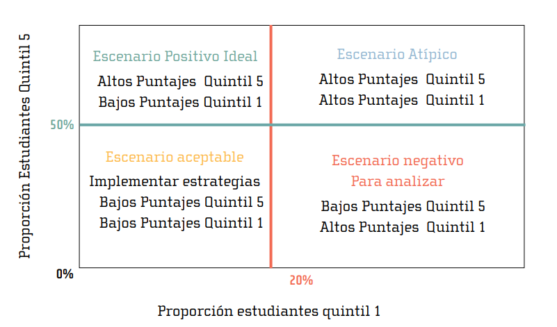

```{r setup, include=FALSE}
options(htmltools.dir.version = FALSE)
```

```{r, echo=FALSE, message=FALSE, warning=FALSE, fig.align='center'}

source("Manipulación.R")
source("Funciones.R", encoding = 'UTF-8')
```

# Contenido

.pull-left[
 ### [1. Programas académicos](https://estadisticaun.github.io/TendenciasPGD2018/#3)
 ### [2. Inscritos y admitidos](https://estadisticaun.github.io/TendenciasPGD2018/#9)
 ### [3. Matriculados primera vez](https://estadisticaun.github.io/TendenciasPGD2018/#24)
 ### [4. Matriculados](https://estadisticaun.github.io/TendenciasPGD2018/#27)
 ### [5. Graduados](https://estadisticaun.github.io/TendenciasPGD2018/#38)
 ### [6. Docentes de carrera](https://estadisticaun.github.io/TendenciasPGD2018/#47) 
 ]
 
 .pull-right[
 
 ### [7. Razón de estudiantes por docente](https://estadisticaun.github.io/TendenciasPGD2018/#62) 
 ### [8. Administrativos de carrera](https://estadisticaun.github.io/TendenciasPGD2018/#66) 
 ### [9. Capacidad y resultados de investigación](https://estadisticaun.github.io/TendenciasPGD2018/#76) 
 ### [10. Bienestar universitario](https://estadisticaun.github.io/TendenciasPGD2018/#92) 
 ### [11. Pruebas Saber PRO 2017](https://estadisticaun.github.io/TendenciasPGD2018/#96) 
 ### [12. Deserción](https://estadisticaun.github.io/TendenciasPGD2018/#121) 
]

---

class: inverse, middle, center

# 1. Programas Académicos

---
### Evolución número programas académicos de pregrado y postgrado

```{r, echo=FALSE, message=FALSE, warning=FALSE, fig.align='center'}
Programas <- series(
  datos = Tendencias,
  categoria = "Programas",
  colores = col,
  titulo = " ",
  eje = "Número de programas académicos"
);Programas
```

---

# <h3> Evolución número programas académicos de postgrado </h3>

```{r, echo=FALSE, message=FALSE, warning=FALSE, fig.align='center'}

col <-   c("#8cc63f", # verde
           "#6d6666", # gris, Tumaco)
           "#29abe2", # azul claro
           "#f15a24" # naranja
           ) 

series(
  datos = Tendencias,
  categoria = "ProgramasP",
  colores = col,
  titulo = " ",
  eje = "Número de programas académicos"
)
```

---

# <h3> Proporción de programas acreditados de pregrado </h3>

```{r, echo=FALSE, message=FALSE, warning=FALSE, fig.align='center'}

ano <- 2017
semestre <- 2 # 1 o 2 según corresponda
periodo_actual_titulo <- " 2017"


col <-   c("#8cc63f", # verde
           "#29abe2" # azul claro
           ) 

torta(
  datos = Tendencias,
  variable = "AcreditacionPRE",
  colores = col,
  titulo = " ",
  etiqueta = "Programas de pregrado",
  ano = ano,
  periodo = semestre,
  periodo_titulo = periodo_actual_titulo
)

```
---

# <h3> Proporción de programas acreditados de postgrado - Total </h3>

```{r, echo=FALSE, message=FALSE, warning=FALSE, fig.align='center'}

ano <- 2017
semestre <- 2 # 1 o 2 según corresponda
periodo_actual_titulo <- " 2017"


col <-   c("#8cc63f", # verde
           "#29abe2", # azul claro
           "#f15a24" # naranja
           )  

torta(
  datos = Tendencias,
  variable = "AcreditacionPOS",
  colores = col,
  titulo = " ",
  etiqueta = "Programas de postgrado",
  ano = ano,
  periodo = semestre,
  periodo_titulo = periodo_actual_titulo
)

```

---

# <h3> Proporción de programas acreditados de postgrado - Acreditables</h3>

```{r, echo=FALSE, message=FALSE, warning=FALSE, fig.align='center'}
ano <- 2017
semestre <- 2 # 1 o 2 según corresponda
periodo_actual_titulo <- " 2017"

col <-   c("#6d6666", # gris, Tumaco)
           "#8cc63f", # verde
           "#29abe2", # azul claro
           "#f15a24" # naranja
           )  


torta(
  datos = Tendencias,
  variable = "AcreditacionPOST",
  colores = col,
  titulo = " ",
  etiqueta = "Programas de postgrado",
  ano = ano,
  periodo = semestre,
  periodo_titulo = periodo_actual_titulo
)

```

---

class: inverse, middle, center

# 2. Inscritos y Admitidos

---

# <h3> Evolución de inscritos a la Universidad -pregrado y postgrado- </h3>

```{r, echo=FALSE, message=FALSE, warning=FALSE, fig.align='center'}
col <-   c("#f15a24") # verde
series(
  datos = Tendencias,
  categoria = "Inscritos",
  colores = col,
  titulo = " ",
  eje = "Número de inscritos (K: miles)"
)
```

---

# <h3> Evolución de inscritos a la Universidad por nivel de formación</h3>

```{r, echo=FALSE, message=FALSE, warning=FALSE, fig.align='center'}

col <-   c("#f15a24", # naranja
           "#8cc63f") # verde
series(
  datos = Tendencias,
  categoria = "InscritosNIV",
  colores = col,
  titulo = " ",
  eje = "Número de inscritos (K: miles)"
)
```

---

# <h3> Evolución de inscritos y admitidos a pregrado </h3>

```{r, echo=FALSE, message=FALSE, warning=FALSE, fig.align='center'}

col <-   c("#f15a24", # naranja
           "#8cc63f") # verde
series(
  datos = Tendencias,
  categoria = "InscritosPRE",
  colores = col,
  titulo = " ",
  eje = "Número de inscritos (K: miles)"
)
```

---

# <h3> Evolución de inscritos a pregrado por sexo </h3>

```{r, echo=FALSE, message=FALSE, warning=FALSE, fig.align='center'}

col <-   c("#f15a24", # naranja
           "#8cc63f") # verde
series(
  datos = Tendencias,
  categoria = "InscritosPRESEX",
  colores = col,
  titulo = " ",
  eje = "Número de inscritos (K: miles)"
)
```


---

# <h3> Evolución de admitidos a pregrado por sexo </h3>

```{r, echo=FALSE, message=FALSE, warning=FALSE, fig.align='center'}

col <-   c("#f15a24", # naranja
           "#8cc63f") # verde
series(
  datos = Tendencias,
  categoria = "AdmitidosPRESEX",
  colores = col,
  titulo = " ",
  eje = "Número de inscritos (K: miles)"
)
```

---

# <h3> Inscritos a pregrado por sede de inscripción </h3>

```{r, echo=FALSE, message=FALSE, warning=FALSE, fig.align='center'}

ano <- 2018
semestre <- 2 # 1 o 2 según corresponda
periodo_actual_titulo <- " 2018-2"

col <-   c( "#29abe2", # azul claro, Amazonia
            "#8cc63f", # verde, Bogotá
            "#c1272d", # rojo, Caribe
            "#0071bc", # azul vivo, Manizales
            "#f15a24", # naranja, Medellin
            "#fbb03b", # amarillo, Orinoquia
            "#93278f", # morado, Palmira
            "#ed1e79",
            "#6d6666"# rosado, sin información
          )

barra_horizontal(
  datos = Tendencias,
  categoria = "SedeINSPRE",
  colores = col,
  ano = ano,
  periodo = semestre,
  periodo_titulo = periodo_actual_titulo,
  titulo = " ", 
  eje = "Número de inscritos")

```
---

# <h3> Admitidos a pregrado por sede de admisión </h3>

```{r, echo=FALSE, message=FALSE, warning=FALSE, fig.align='center'}

ano <- 2018
semestre <- 2 # 1 o 2 según corresponda
periodo_actual_titulo <- " 2018-2"

col <-   c( "#29abe2", # azul claro, Amazonia
            "#8cc63f", # verde, Bogotá
            "#c1272d", # rojo, Caribe
            "#0071bc", # azul vivo, Manizales
            "#f15a24", # naranja, Medellin
            "#fbb03b", # amarillo, Orinoquia
            "#93278f", # morado, Palmira
            "#ed1e79" )

barra_horizontal(
  datos = Tendencias,
  categoria = "SedeADMPRE",
  colores = col,
  ano = ano,
  periodo = semestre,
  periodo_titulo = periodo_actual_titulo,
  titulo = " ", 
  eje = "Número de admitidos")

```

---

# <h3> Evolución de inscritos a pregrado por tipo de inscripción </h3>

```{r, echo=FALSE, message=FALSE, warning=FALSE, fig.align='center'}

col <-   c("#f15a24", # naranja
           "#8cc63f", # verde
           "#29abe2") # azul
series(
  datos = Tendencias,
  categoria = "Especial",
  colores = col,
  titulo = " ",
  eje = "Número de inscritos (K: miles)"
)
```

---

# <h3> Evolución de inscritos a pregrado Programa PAES </h3>

```{r, echo=FALSE, message=FALSE, warning=FALSE, fig.align='center'}

col <- c( "#29abe2", # azul claro, Amazonia
            "#8cc63f", # verde, Bogotá
            "#c1272d", # rojo, Caribe
            "#0071bc", # azul vivo, Manizales
            "#f15a24") # 
series(
  datos = Tendencias,
  categoria = "PAES",
  colores = col,
  titulo = " ",
  eje = "Número de inscritos (K: miles)"
)
```


---

# <h3> Evolución de inscritos a pregrado Programa PEAMA </h3>

```{r, echo=FALSE, message=FALSE, warning=FALSE, fig.align='center'}

col <- c( "#93278f",
          "#29abe2", # azul claro, Amazonia
            "#8cc63f", # verde, Bogotá
            "#c1272d", # rojo, Caribe
            "#0071bc",# azul vivo,Manizales
            "#f15a24",
            "#fbb03b" # amarillo, Orinoquia
            ) # 
series(
  datos = Tendencias,
  categoria = "PEAMA",
  colores = col,
  titulo = " ",
  eje = "Número de inscritos (K: miles)"
)
```
---

# <h3> Situación actual de inscritos a pregrado por tipo de inscripción </h3>

```{r, echo=FALSE, message=FALSE, warning=FALSE, fig.align='center'}
ano <- 2018
semestre <- 2 # 1 o 2 según corresponda
periodo_actual_titulo <- " 2018-2"

col <-   c("#f15a24", # naranja
           "#8cc63f", # verde
           "#29abe2") # azul

torta(
  datos = Tendencias,
  variable = "Especial",
  colores = col,
  titulo = " ",
  etiqueta = "Inscritos a pregrado",
  ano = ano,
  periodo = semestre,
  periodo_titulo = periodo_actual_titulo
)
```

---

# <h3> Situación actual de admitidos a pregrado por tipo de inscripción </h3>

```{r, echo=FALSE, message=FALSE, warning=FALSE, fig.align='center'}
ano <- 2018
semestre <- 2 # 1 o 2 según corresponda
periodo_actual_titulo <- " 2018-2"

col <-   c("#f15a24", # naranja
           "#8cc63f", # verde
           "#29abe2") # azul

torta(
  datos = Tendencias,
  variable = "EspecialADM",
  colores = col,
  titulo = " ",
  etiqueta = "Inscritos a pregrado",
  ano = ano,
  periodo = semestre,
  periodo_titulo = periodo_actual_titulo
)
```

---

# <h3> Evolución de inscritos y admitidos a postgrado </h3>

```{r, echo=FALSE, message=FALSE, warning=FALSE, fig.align='center'}

col <-   c("#f15a24", # naranja
           "#8cc63f") # verde
series(
  datos = Tendencias,
  categoria = "InscritosPOS",
  colores = col,
  titulo = " ",
  eje = "Número de inscritos (K: miles)"
)
```
---

# <h3> Proporción de admitidos a postgrado por origen de IES </h3>

```{r, echo=FALSE, message=FALSE, warning=FALSE, fig.align='center'}
ano <- 2017
semestre <- 2 # 1 o 2 según corresponda
periodo_actual_titulo <- " 2017"

col <-   c( "#8cc63f", # verde
            "#f15a24",
            "#c1272d", # rojo
            "#29abe2") # azul claro
torta(
  datos = Tendencias,
  variable = "AdmitidosPOSIES",
  colores = col,
  titulo = " ",
  etiqueta = "Admitidos a postgrado",
  ano = ano,
  periodo = semestre,
  periodo_titulo = periodo_actual_titulo
)
```

---

class: inverse, middle, center

# 3. Matriculados primera vez

---

# <h3> Evolución matriculados primera vez - pregrado </h3>

```{r, echo=FALSE, message=FALSE, warning=FALSE, fig.align='center'}

col <-   c("#8cc63f",
           "#f15a24", # naranja
            "#29abe2",
           "#c1272d") # verde
series(
  datos = Tendencias,
  categoria = "MPVZPRE",
  colores = col,
  titulo = " ",
  eje = "Número de estudiantes (K: miles)"
)
```

---

# <h3> Evolución matriculados primera vez - postgrado </h3>

```{r, echo=FALSE, message=FALSE, warning=FALSE, fig.align='center'}

col <-   c("#8cc63f",
           "#f15a24", # naranja
            "#29abe2",
           "#c1272d") # verde
series(
  datos = Tendencias,
  categoria = "MPVZPOS",
  colores = col,
  titulo = " ",
  eje = "Número de estudiantes (K: miles)"
)
```

---

class: inverse, middle, center

# 4. Matriculados 

---

# <h3> Evolución estudiantes matriculados </h3>

```{r, echo=FALSE, message=FALSE, warning=FALSE, fig.align='center'}

col <-   c("#f15a24") # verde
series(
  datos = Tendencias,
  categoria = "Matriculados",
  colores = col,
  titulo = " ",
  eje = "Número de estudiantes (K: miles)"
)
```
---

# <h3> Evolución matriculados por sedes</h3>

```{r, echo=FALSE, message=FALSE, warning=FALSE, fig.align='center'}

col <-   c( "#29abe2", # azul claro, Amazonia
            "#8cc63f", # verde, Bogotá
            "#c1272d", # rojo, Caribe
            "#0071bc", # azul vivo, Manizales
            "#f15a24", # naranja, Medellin
            "#fbb03b", # amarillo, Orinoquia
            "#93278f", # morado, Palmira
            "#ed1e79" )

series(
  datos = Tendencias,
  categoria = "MatriculadosSED",
  colores = col,
  titulo = " ",
  eje = "Número de estudiantes (K: miles)"
)
```
---

# <h3> Proporción de matriculados por sede </h3>

```{r, echo=FALSE, message=FALSE, warning=FALSE, fig.align='center'}
ano <- 2017
semestre <- 2 # 1 o 2 según corresponda
periodo_actual_titulo <- " 2017"


col <-   c( "#29abe2", # azul claro, Amazonia
            "#8cc63f", # verde, Bogotá
            "#c1272d", # rojo, Caribe
            "#0071bc", # azul vivo, Manizales
            "#f15a24", # naranja, Medellin
            "#fbb03b", # amarillo, Orinoquia
            "#93278f", # morado, Palmira
            "#ed1e79" )
torta(
  datos = Tendencias,
  variable = "MatriculadosSED",
  colores = col,
  titulo = " ",
  etiqueta = "Total matriculados",
  ano = ano,
  periodo = semestre,
  periodo_titulo = periodo_actual_titulo
)
```

---

# <h3> Evolución matriculados por nivel de formación </h3>

```{r, echo=FALSE, message=FALSE, warning=FALSE, fig.align='center'}

col <-   c("#f15a24", # naranja
           "#8cc63f") # verde
series(
  datos = Tendencias,
  categoria = "MatriculadosNIV",
  colores = col,
  titulo = " ",
  eje = "Número de estudiantes (K: miles)"
)
```

---

# <h3> Evolución matriculados en postgrado por nivel de formación</h3>

```{r, echo=FALSE, message=FALSE, warning=FALSE, fig.align='center'}

col <-   c( "#29abe2",
            "#c1272d", # rojo
            "#8cc63f", # verde
            "#f15a24"
            ) # azul claro
series(
  datos = Tendencias,
  categoria = "MatriculadosPOS",
  colores = col,
  titulo = " ",
  eje = "Número de estudiantes (K: miles)"
)
```

---

# <h3> Evolución matriculados en pregrado por modalidad de admisión</h3>

```{r, echo=FALSE, message=FALSE, warning=FALSE, fig.align='center'}

col <-   c("#f15a24", # naranja
           "#8cc63f",
            "#29abe2") # verde
series(
  datos = Tendencias,
  categoria = "EspecialMAT",
  colores = col,
  titulo = " ",
  eje = "Número de estudiantes (K: miles)"
)
```
---

# <h3> Proporción de matriculados por modalidad de admisión </h3>

```{r, echo=FALSE, message=FALSE, warning=FALSE, fig.align='center'}

ano <- 2017
semestre <- 2 # 1 o 2 según corresponda
periodo_actual_titulo <- " 2017"

col <-   c( "#8cc63f", # verde
            "#f15a24",
            "#29abe2") # azul claro
torta(
  datos = Tendencias,
  variable = "MatriculadosACT",
  colores = col,
  titulo = " ",
  etiqueta = "Matriculados en pregrado",
  ano = ano,
  periodo = semestre,
  periodo_titulo = periodo_actual_titulo
)
```

---

# <h3> Evolución de matriculados del Programa PAES </h3>

```{r, echo=FALSE, message=FALSE, warning=FALSE, fig.align='center'}

col <- c( "#29abe2", # azul claro, Amazonia
            "#8cc63f", # verde, Bogotá
            "#c1272d", # rojo, Caribe
            "#0071bc", # azul vivo, Manizales
            "#f15a24") # 
series(
  datos = Tendencias,
  categoria = "MatPAES",
  colores = col,
  titulo = " ",
  eje = "Número de matriculados"
)
```

---

# <h3> Evolución de matriculados del Programa PEAMA </h3>

```{r, echo=FALSE, message=FALSE, warning=FALSE, fig.align='center'}

col <- c( "#93278f",
          "#29abe2", # azul claro, Amazonia
            "#8cc63f", # verde, Bogotá
            "#c1272d", # rojo, Caribe
            "#0071bc",# azul vivo,Manizales
            "#f15a24") # 
series(
  datos = Tendencias,
  categoria = "MatPEAMA",
  colores = col,
  titulo = " ",
  eje = "Número de matriculados"
)

```

 <p style="color:red;"> 
 <h5> .footnote[[*] Incluye los estudiantes matriculados en las sedes andinas] </h5> 
 </p>
 
---

#  <h3> Proporción de matriculados por sexo y nivel de formación </h3>

.pull-left[

```{r, echo=FALSE, message=FALSE, warning=FALSE, fig.align='center'}
ano <- 2017
semestre <- 2 # 1 o 2 según corresponda
periodo_actual_titulo <- " 2017"

col <-   c("#f15a24", # naranja
           "#8cc63f" # verde
           ) # azul

torta(
  datos = Tendencias,
  variable = "MatriculadosSEXPRE",
  colores = col,
  titulo = "Pregrado ",
  etiqueta = "Matriculados",
  ano = ano,
  periodo = semestre,
  periodo_titulo = periodo_actual_titulo
)

```
]

.pull-right[
```{r, echo=FALSE, message=FALSE, warning=FALSE, fig.align='center'}
ano <- 2017
semestre <- 2 # 1 o 2 según corresponda
periodo_actual_titulo <- " 2017"

col <-   c("#f15a24", # naranja
           "#8cc63f" # verde
           ) # azul
torta(
  datos = Tendencias,
  variable = "MatriculadosSEXPOS",
  colores = col,
  titulo = "Postgrado ",
  etiqueta = "Matriculados",
  ano = ano,
  periodo = semestre,
  periodo_titulo = periodo_actual_titulo)

```
]

---

class: inverse, middle, center

# 5. Graduados


---

# <h3> Evolución anual de estudiantes graduados </h3>

```{r, echo=FALSE, message=FALSE, warning=FALSE, fig.align='center'}

col <-   c("#f15a24") # verde
series_a(
  datos = Tendencias,
  categoria = "Graduados",
  colores = col,
  titulo = " ",
  eje = "Número de graduados (K: miles)"
)
```

---

# <h3> Evolución anual de estudiantes graduados sedes andinas</h3>

```{r, echo=FALSE, message=FALSE, warning=FALSE, fig.align='center'}

col <-   c( "#29abe2", # azul claro, Amazonia
            "#8cc63f", # verde, Bogotá
            "#f15a24", # rojo, Caribe
            "#0071bc")
series_a(
  datos = Tendencias,
  categoria = "GraduadosSED",
  colores = col,
  titulo = " ",
  eje = "Número de graduados (K: miles)"
)
```

---

# <h3> Proporción de graduados sedes andinas </h3>

```{r, echo=FALSE, message=FALSE, warning=FALSE, fig.align='center'}

ano <- 2017
semestre <- 2 # 1 o 2 según corresponda
periodo_actual_titulo <- " 2017"


col <-   c( "#29abe2", # azul claro, Amazonia
            "#8cc63f", # verde, Bogotá
            "#f15a24", # naranja, Medellin
            "#0071bc" # azul vivo, Manizales
            )

torta(
  datos = Tendencias,
  variable = "GraduadosSEDACT",
  colores = col,
  titulo = " ",
  etiqueta = "Total graduados",
  ano = ano,
  periodo = semestre,
  periodo_titulo = periodo_actual_titulo
)
```

---

# <h3> Evolución anual de estudiantes graduados por nivel de formación</h3>

```{r, echo=FALSE, message=FALSE, warning=FALSE, fig.align='center'}

col <-   c("#f15a24", # naranja
           "#8cc63f") # verde
series_a(
  datos = Tendencias,
  categoria = "GraduadosNIV",
  colores = col,
  titulo = " ",
  eje = "Número de graduados (K: miles)"
)
```

---

# <h3> Evolución de graduados en postgrado por modalidad de formación</h3>

```{r, echo=FALSE, message=FALSE, warning=FALSE, fig.align='center'}

col <-   c( "#29abe2", # azul claro, Amazonia
            "#8cc63f", # verde, Bogotá
            "#f15a24", # rojo, Caribe
            "#0071bc")
series_a(
  datos = Tendencias,
  categoria = "GraduadosPOSMOD",
  colores = col,
  titulo = " ",
  eje = "Número de graduados"
)
```
---

# <h3> Evolución de graduados en pregrado por modalidad de admisión</h3>

```{r, echo=FALSE, message=FALSE, warning=FALSE, fig.align='center'}

col <-   c( "#29abe2", # azul claro, Amazonia
            "#8cc63f", # verde, Bogotá
            "#f15a24" # rojo, Caribe
            )
series_a(
  datos = Tendencias,
  categoria = "GraduadosTADM",
  colores = col,
  titulo = " ",
  eje = "Número de graduados"
)
```

---

# <h3> Proporción de graduados en pregrado por modalidad de admisión </h3>

```{r, echo=FALSE, message=FALSE, warning=FALSE, fig.align='center'}

ano <- 2017
semestre <- 2 # 1 o 2 según corresponda
periodo_actual_titulo <- " 2017"


col <-   c( "#29abe2", # azul claro, Amazonia
            "#8cc63f", # verde, Bogotá
            "#f15a24" # naranja, Medellin
                        )

torta(
  datos = Tendencias,
  variable = "GraduadosTADMACT",
  colores = col,
  titulo = " ",
  etiqueta = "Total graduados",
  ano = ano,
  periodo = semestre,
  periodo_titulo = periodo_actual_titulo
)
```


---

#  <h3> Proporción de graduados por sexo y nivel de formación </h3>

.pull-left[

```{r, echo=FALSE, message=FALSE, warning=FALSE, fig.align='center'}

ano <- 2017
semestre <- 2 # 1 o 2 según corresponda
periodo_actual_titulo <- " 2017"

col <-   c("#f15a24", # naranja
           "#8cc63f" # verde
           ) # azul

torta(
  datos = Tendencias,
  variable = "GraduadosSEXPRE",
  colores = col,
  titulo = "Pregrado ",
  etiqueta = "Graduados",
  ano = ano,
  periodo = semestre,
  periodo_titulo = periodo_actual_titulo
)

```
]

.pull-right[
```{r, echo=FALSE, message=FALSE, warning=FALSE, fig.align='center'}
ano <- 2017
semestre <- 2 # 1 o 2 según corresponda
periodo_actual_titulo <- " 2017"

col <-   c("#f15a24", # naranja
           "#8cc63f" # verde
           ) # azul
torta(
  datos = Tendencias,
  variable = "GraduadosSEXPOS",
  colores = col,
  titulo = "Postgrado ",
  etiqueta = "Graduados",
  ano = ano,
  periodo = semestre,
  periodo_titulo = periodo_actual_titulo)

```
]

---

class: inverse, middle, center

# 6. Docentes de carrera

---

# <h3> Evolución anual de docentes de carrera </h3>

```{r, echo=FALSE, message=FALSE, warning=FALSE, fig.align='center'}

col <-   c("#f15a24") # verde

series_a(
  datos = Tendencias,
  categoria = "Docentes",
  colores = col,
  titulo = " ",
  eje = "Número de docentes"
)
```
---

# <h3> Evolución anual docentes de carrera por sedes</h3>

```{r, echo=FALSE, message=FALSE, warning=FALSE, fig.align='center'}

col <-   c( "#29abe2", # azul claro, Amazonia
            "#8cc63f", # verde, Bogotá
            "#c1272d", # rojo, Caribe
            "#0071bc", # azul vivo, Manizales
            "#f15a24", # naranja, Medellin
            "#fbb03b", # amarillo, Orinoquia
            "#93278f" # morado, Palmira
         )

series_a(
  datos = Tendencias,
  categoria = "DocentesSED",
  colores = col,
  titulo = " ",
  eje = "Número de docentes"
)
```
---

# <h3> Proporción actual de docentes de carrera por sede </h3>

```{r, echo=FALSE, message=FALSE, warning=FALSE, fig.align='center'}
ano <- 2018
semestre <- 1 # 1 o 2 según corresponda
periodo_actual_titulo <- " 2018"


col <-   c( "#29abe2", # azul claro, Amazonia
            "#8cc63f", # verde, Bogotá
            "#c1272d", # rojo, Caribe
            "#0071bc", # azul vivo, Manizales
            "#f15a24", # naranja, Medellin
            "#fbb03b", # amarillo, Orinoquia
            "#93278f" # morado, Palmira
             )
torta(
  datos = Tendencias,
  variable = "DocentesSEDACT",
  colores = col,
  titulo = " ",
  etiqueta = "Total docentes",
  ano = ano,
  periodo = semestre,
  periodo_titulo = periodo_actual_titulo
)
```

---

# <h3> Evolución anual docentes de carrera por dedicación</h3>

```{r, echo=FALSE, message=FALSE, warning=FALSE, fig.align='center'}

col <-   c( "#0071bc", # azul vivo, Manizales
            "#8cc63f", # verde, Bogotá
            "#c1272d", # rojo, Caribe
            "#f15a24" # naranja, Medellin
         )

series_a(
  datos = Tendencias,
  categoria = "DocentesDED",
  colores = col,
  titulo = " ",
  eje = "Número de docentes"
)
```

---

# <h3> Proporción actual de docentes de carrera por dedicación </h3>

```{r, echo=FALSE, message=FALSE, warning=FALSE, fig.align='center'}
ano <- 2018
semestre <- 1 # 1 o 2 según corresponda
periodo_actual_titulo <- " 2018"

col <-   c( "#0071bc", # azul vivo, Manizales
            "#8cc63f", # verde, Bogotá
            "#c1272d", # rojo, Caribe
            "#f15a24" # naranja, Medellin
         )

torta(
  datos = Tendencias,
  variable = "DocentesDEDACT",
  colores = col,
  titulo = " ",
  etiqueta = "Total docentes",
  ano = ano,
  periodo = semestre,
  periodo_titulo = periodo_actual_titulo
)
```

---

# <h3> Evolución anual docentes de carrera por máximo nivel de formación</h3>

```{r, echo=FALSE, message=FALSE, warning=FALSE, fig.align='center'}

col <-   c( "#8cc63f", # verde, Bogotá
            "#f15a24", # naranja, Medellin
            "#0071bc", # azul vivo, Manizales
            "#c1272d" # rojo, Caribe
         )

series_a(
  datos = Tendencias,
  categoria = "DocentesFOR",
  colores = col,
  titulo = " ",
  eje = "Número de docentes"
)
```

---

# <h3> Proporción de docentes de carrera por máximo nivel de formación </h3>

```{r, echo=FALSE, message=FALSE, warning=FALSE, fig.align='center'}
ano <- 2018
semestre <- 1 # 1 o 2 según corresponda
periodo_actual_titulo <- " 2018"

col <-   c( "#8cc63f", # verde, Bogotá
            "#f15a24", # naranja, Medellin
            "#0071bc", # azul vivo, Manizales
            "#c1272d" # rojo, Caribe
         )

torta(
  datos = Tendencias,
  variable = "DocentesFORACT",
  colores = col,
  titulo = " ",
  etiqueta = "Total docentes",
  ano = ano,
  periodo = semestre,
  periodo_titulo = periodo_actual_titulo
)
```

---

#  <h3> Universidad de formación docentes con doctorado </h3>


```{r, echo=FALSE, message=FALSE, warning=FALSE, fig.align='center'}

ano <- 2018
semestre <- 1 # 1 o 2 según corresponda
periodo_actual_titulo <- " 2018"

col <-   c("#f15a24", # naranja
           "#8cc63f", # verde
           "#0071bc" # azul vivo, Manizales
           ) 

torta(
  datos = Tendencias,
  variable = "DoctoradoIES",
  colores = col,
  titulo = " ",
  etiqueta = "Docentes",
  ano = ano,
  periodo = semestre,
  periodo_titulo = periodo_actual_titulo
)

```

---

#  <h3> Universidad de formación docentes con maestría </h3>

```{r, echo=FALSE, message=FALSE, warning=FALSE, fig.align='center'}
ano <- 2018
semestre <- 1 # 1 o 2 según corresponda
periodo_actual_titulo <- " 2018"

col <-   c("#f15a24", # naranja
           "#8cc63f", # verde
           "#0071bc" # azul vivo, Manizales
           ) 

torta(
  datos = Tendencias,
  variable = "MaestríaIES",
  colores = col,
  titulo = " ",
  etiqueta = "Docentes",
  ano = ano,
  periodo = semestre,
  periodo_titulo = periodo_actual_titulo)

```

---

# <h3> Países de origen de universidades de docentes con doctorado </h3>

```{r, echo=FALSE, message=FALSE, warning=FALSE, fig.align='center'}

ano <- 2018
semestre <- 1 # 1 o 2 según corresponda
periodo_actual_titulo <- " 2018-1"

col <-   c( "#29abe2", # azul claro, Amazonia
            "#c1272d", # rojo, Caribe
            "#8cc63f", # verde, Bogotá
            "#0071bc", # azul vivo, Manizales
            "#f15a24", # naranja, Medellin
            "#fbb03b", # amarillo, Orinoquia
            "#93278f", # morado, Palmira
            "#ed1e79",
            "#6d6666"# rosado, sin información
          )

barra_horizontal(
  datos = Tendencias,
  categoria = "PaísUDOC",
  colores = col,
  ano = ano,
  periodo = semestre,
  periodo_titulo = periodo_actual_titulo,
  titulo = " ", 
  eje = "Número de docentes")
```
---

# <h3> Evolución anual docentes de carrera por rango de edad</h3>

```{r, echo=FALSE, message=FALSE, warning=FALSE, fig.align='center'}

col <-   c( "#c1272d", # rojo, Caribe
            "#f15a24", # naranja, Medellin
            "#0071bc", # azul vivo, Manizales
            "#6d6666",
            "#8cc63f" # verde, Bogotá
            )

series_a(
  datos = Tendencias,
  categoria = "DocentesEDAD",
  colores = col,
  titulo = " ",
  eje = "Número de docentes"
)
```

---

# <h3> Proporción de docentes de carrera por rango de edad </h3>

```{r, echo=FALSE, message=FALSE, warning=FALSE, fig.align='center'}
ano <- 2018
semestre <- 1 # 1 o 2 según corresponda
periodo_actual_titulo <- " 2018"

col <-   c( "#c1272d", # rojo, Caribe
            "#f15a24", # naranja, Medellin
            "#0071bc", # azul vivo, Manizales
            "#6d6666",
            "#8cc63f" # verde, Bogotá
            )

torta(
  datos = Tendencias,
  variable = "DocentesEDADACT",
  colores = col,
  titulo = " ",
  etiqueta = "Total docentes",
  ano = ano,
  periodo = semestre,
  periodo_titulo = periodo_actual_titulo
)
```

---

# <h3> Evolución anual docentes de carrera por sexo</h3>

```{r, echo=FALSE, message=FALSE, warning=FALSE, fig.align='center'}

col <-   c( "#f15a24", # naranja, Medellin
            "#8cc63f" # verde, Bogotá
            )

series_a(
  datos = Tendencias,
  categoria = "DocentesSEX",
  colores = col,
  titulo = " ",
  eje = "Número de docentes"
)

```

---

# <h3> Proporción de docentes de carrera por sexo </h3>

```{r, echo=FALSE, message=FALSE, warning=FALSE, fig.align='center'}
ano <- 2018
semestre <- 1 # 1 o 2 según corresponda
periodo_actual_titulo <- " 2018"

col <-   c( "#f15a24", # naranja, Medellin
            "#8cc63f" # verde, Bogotá
            )

torta(
  datos = Tendencias,
  variable = "DocentesSEXACT",
  colores = col,
  titulo = " ",
  etiqueta = "Total docentes",
  ano = ano,
  periodo = semestre,
  periodo_titulo = periodo_actual_titulo
)
```

---

class: inverse, middle, center

# 7. Razón de estudiantes por docente

---

# <h3> Evolución anual razón de estudiantes por docente </h3>

```{r, echo=FALSE, message=FALSE, warning=FALSE, fig.align='center'}

col <-   c("#f15a24") # verde

series_a(
  datos = Tendencias,
  categoria = "Razon",
  colores = col,
  titulo = " ",
  eje = "Razón"
)
```

---

# <h3> Evolución anual razón estudiantes por docente - sedes andinas</h3>

```{r, echo=FALSE, message=FALSE, warning=FALSE, fig.align='center'}

col <-   c("#6d6666", # gris, Tumaco
            "#8cc63f", # verde, Bogotá
            "#0071bc", # azul vivo, Manizales
            "#f15a24" # naranja, Medellin
            )

series_a(
  datos = Tendencias,
  categoria = "RazonSED",
  colores = col,
  titulo = " ",
  eje = "Razón"
)

```
---

# <h3> Estado actual razón de estudiantes por docente - sedes andinas </h3>

```{r, echo=FALSE, message=FALSE, warning=FALSE, fig.align='center'}

ano <- 2017
semestre <- 2 # 1 o 2 según corresponda
periodo_actual_titulo <- " 2017"

col <-   c("#6d6666", # gris, Tumaco
            "#8cc63f", # verde, Bogotá
            "#0071bc", # azul vivo, Manizales
            "#f15a24" # naranja, Medellin
            )

barra_vertical(
  datos = Tendencias,
  categoria = "RazonSEDACT",
  colores = col,
  ano = ano,
  periodo = semestre,
  periodo_titulo = periodo_actual_titulo,
  titulo = " ", 
  eje = "Razón")

```

---

class: inverse, middle, center

# 8. Administrativos de carrera

---

# <h3> Evolución anual de administrativos de carrera </h3>

```{r, echo=FALSE, message=FALSE, warning=FALSE, fig.align='center'}

col <-   c("#f15a24") # verde

series_a(
  datos = Tendencias,
  categoria = "Administrativos",
  colores = col,
  titulo = " ",
  eje = "Número de administrativos"
)
```
---

# <h3> Evolución anual de administrativos de carrera por sedes</h3>

```{r, echo=FALSE, message=FALSE, warning=FALSE, fig.align='center'}

col <-   c( "#29abe2", # azul claro, Amazonia
            "#8cc63f", # verde, Bogotá
            "#c1272d", # rojo, Caribe
            "#0071bc", # azul vivo, Manizales
            "#f15a24", # naranja, Medellin
            "#fbb03b", # amarillo, Orinoquia
            "#93278f", # morado, Palmira
            "#6d6666", # gris, Tumaco
            "#855b5b") # vinotinto

series_a(
  datos = Tendencias,
  categoria = "AdministrativosSED",
  colores = col,
  titulo = " ",
  eje = "Número de administrativos"
)
```
---

# <h3> Proporción actual de administrativos de carrera por sede </h3>

```{r, echo=FALSE, message=FALSE, warning=FALSE, fig.align='center'}
ano <- 2018
semestre <- 1 # 1 o 2 según corresponda
periodo_actual_titulo <- " 2018"


col <-   c( "#29abe2", # azul claro, Amazonia
            "#8cc63f", # verde, Bogotá
            "#c1272d", # rojo, Caribe
            "#0071bc", # azul vivo, Manizales
            "#f15a24", # naranja, Medellin
            "#fbb03b", # amarillo, Orinoquia
            "#93278f", # morado, Palmira
            "#6d6666", # gris, Tumaco
            "#855b5b") # vinotinto
             
torta(
  datos = Tendencias,
  variable = "AdministrativosSEDACT",
  colores = col,
  titulo = " ",
  etiqueta = "Total administrativos",
  ano = ano,
  periodo = semestre,
  periodo_titulo = periodo_actual_titulo
)
```

---

# <h3> Evolución anual de administrativos por máximo nivel de formación</h3>

```{r, echo=FALSE, message=FALSE, warning=FALSE, fig.align='center'}

col <-   c( "#29abe2", # azul claro, Amazonia
            "#8cc63f", # verde, Bogotá
            "#c1272d", # rojo, Caribe
            "#0071bc", # azul vivo, Manizales
            "#f15a24", # naranja, Medellin
            "#6d6666", # gris, Tumaco
            "#93278f", # morado, Palmira
            "#fbb03b", # amarillo, Orinoquia
            "#855b5b") # vinotinto

series_a(
  datos = Tendencias,
  categoria = "AdministrativosFOR",
  colores = col,
  titulo = " ",
  eje = "Número de administrativos"
)
```
---

# <h3> Proporción actual de administrativos por máximo nivel de formación </h3>

```{r, echo=FALSE, message=FALSE, warning=FALSE, fig.align='center'}
ano <- 2018
semestre <- 1 # 1 o 2 según corresponda
periodo_actual_titulo <- " 2018"


col <-   c( "#29abe2", # azul claro, Amazonia
            "#8cc63f", # verde, Bogotá
            "#c1272d", # rojo, Caribe
            "#0071bc", # azul vivo, Manizales
            "#f15a24", # naranja, Medellin
            "#6d6666", # gris, Tumaco
            "#93278f", # morado, Palmira
            "#fbb03b", # amarillo, Orinoquia
            "#855b5b") # vinotinto
             
torta(
  datos = Tendencias,
  variable = "AdministrativosFORACT",
  colores = col,
  titulo = " ",
  etiqueta = "Total administrativos",
  ano = ano,
  periodo = semestre,
  periodo_titulo = periodo_actual_titulo
)
```

---

# <h3> Evolución anual administrativos de carrera por rangos de edad</h3>

```{r, echo=FALSE, message=FALSE, warning=FALSE, fig.align='center'}

col <-   c( "#c1272d", # rojo, Caribe
            "#f15a24", # naranja, Medellin
            "#0071bc", # azul vivo, Manizales
            "#6d6666",
            "#8cc63f" # verde, Bogotá
            )

series_a(
  datos = Tendencias,
  categoria = "AdministrativosEDAD",
  colores = col,
  titulo = " ",
  eje = "Número de administrativos"
)
```

---

# <h3> Proporción actual de administrativos por rangos de edad</h3>

```{r, echo=FALSE, message=FALSE, warning=FALSE, fig.align='center'}

ano <- 2018
semestre <- 1 # 1 o 2 según corresponda
periodo_actual_titulo <- " 2018"

col <-   c( "#c1272d", # rojo, Caribe
            "#f15a24", # naranja, Medellin
            "#0071bc", # azul vivo, Manizales
            "#6d6666",
            "#8cc63f" # verde, Bogotá
            )

torta(
  datos = Tendencias,
  variable = "AdministrativosEDADACT",
  colores = col,
  titulo = " ",
  etiqueta = "Total docentes",
  ano = ano,
  periodo = semestre,
  periodo_titulo = periodo_actual_titulo
)
```
---

# <h3> Evolución anual administrativos de carrera por sexo</h3>

```{r, echo=FALSE, message=FALSE, warning=FALSE, fig.align='center'}

col <-   c( "#f15a24", # naranja, Medellin
            "#8cc63f" # verde, Bogotá
            )

series_a(
  datos = Tendencias,
  categoria = "AdministrativosSEX",
  colores = col,
  titulo = " ",
  eje = "Número de administrativos"
)

```

---

# <h3> Proporción de administrativos de carrera por sexo </h3>

```{r, echo=FALSE, message=FALSE, warning=FALSE, fig.align='center'}
ano <- 2018
semestre <- 1 # 1 o 2 según corresponda
periodo_actual_titulo <- " 2018"

col <-   c( "#f15a24", # naranja, Medellin
            "#8cc63f" # verde, Bogotá
            )

torta(
  datos = Tendencias,
  variable = "AdministrativosSEXACT",
  colores = col,
  titulo = " ",
  etiqueta = "Total administrativos",
  ano = ano,
  periodo = semestre,
  periodo_titulo = periodo_actual_titulo
)
```

---

class: inverse, middle, center

# 9. Capacidad y resultados de investigación

---

# <h3> Evolución anual de grupos activos de investigación</h3>

```{r, echo=FALSE, message=FALSE, warning=FALSE, fig.align='center'}

col <-   c("#f15a24") # verde

series_a(
  datos = Tendencias,
  categoria = "Grupos",
  colores = col,
  titulo = " ",
  eje = "Número de grupos de investigación"
)
```

---

# <h3> Distribución actual de grupos de investigación por sedes </h3>

```{r, echo=FALSE, message=FALSE, warning=FALSE, fig.align='center'}
ano <- 2017
semestre <- 2 # 1 o 2 según corresponda
periodo_actual_titulo <- " 2017"


col <-   c( "#29abe2", # azul claro, Amazonia
            "#8cc63f", # verde, Bogotá
            "#c1272d", # rojo, Caribe
            "#0071bc", # azul vivo, Manizales
            "#f15a24", # naranja, Medellin
            "#fbb03b", # amarillo, Orinoquia
            "#6d6666" # gris, Tumaco
         ) 
             
torta(
  datos = Tendencias,
  variable = "GruposSED",
  colores = col,
  titulo = " ",
  etiqueta = "Total grupos",
  ano = ano,
  periodo = semestre,
  periodo_titulo = periodo_actual_titulo
)
```

---

# <h3> Evolución grupos de investigación categorizados por Colciencias</h3>

```{r, echo=FALSE, message=FALSE, warning=FALSE, fig.align='center'}

col <-   c( "#f15a24", # naranja, Medellin
            "#8cc63f" # verde, Bogotá
            )

series_a(
  datos = Tendencias,
  categoria = "GruposCAT",
  colores = col,
  titulo = " ",
  eje = "Número de grupos"
)

```
---

# <h3> Proporción actual de grupos categorizados por Colciencias </h3>

```{r, echo=FALSE, message=FALSE, warning=FALSE, fig.align='center'}
ano <- 2017
semestre <- 2 # 1 o 2 según corresponda
periodo_actual_titulo <- " 2017"

col <-   c( "#f15a24", # naranja, Medellin
            "#8cc63f" # verde, Bogotá
            )

torta(
  datos = Tendencias,
  variable = "GruposCATACT",
  colores = col,
  titulo = " ",
  etiqueta = "Total grupos",
  ano = ano,
  periodo = semestre,
  periodo_titulo = periodo_actual_titulo
)
```

---

# <h3> Clasificación grupos categorizados de investigación - Colciencias</h3>

```{r, echo=FALSE, message=FALSE, warning=FALSE, fig.align='center'}
ano <- 2017
semestre <- 2 # 1 o 2 según corresponda
periodo_actual_titulo <- " 2017"


col <-   c( "#29abe2", # azul claro, Amazonia
            "#8cc63f", # verde, Bogotá
            "#c1272d", # rojo, Caribe
            "#6d6666", # gris, Tumaco
            "#f15a24"
         ) 
             
torta(
  datos = Tendencias,
  variable = "GruposCATCOL",
  colores = col,
  titulo = " ",
  etiqueta = "Total grupos",
  ano = ano,
  periodo = semestre,
  periodo_titulo = periodo_actual_titulo
)
```

---

# <h3> Evolución anual de  revistas de investigación</h3>

```{r, echo=FALSE, message=FALSE, warning=FALSE, fig.align='center'}

col <-   c("#f15a24") # verde

series_a(
  datos = Tendencias,
  categoria = "Revistas",
  colores = col,
  titulo = " ",
  eje = "Número de revistas"
)
```

---

# <h3> Evolución anual de revistas por categoría</h3>

```{r, echo=FALSE, message=FALSE, warning=FALSE, fig.align='center'}

col <-   c("#8cc63f", # verde, Bogotá
            "#f15a24", # naranja, Medellin
            "#0071bc", # azul vivo, Manizales
            "#6d6666"
            )

series_a(
  datos = Tendencias,
  categoria = "RevistasCAT",
  colores = col,
  titulo = " ",
  eje = "Número de revistas"
)
```

---

# <h3> Proporción actual de revistas por categoría - Colciencias</h3>

```{r, echo=FALSE, message=FALSE, warning=FALSE, fig.align='center'}

ano <- 2017
semestre <- 2 # 1 o 2 según corresponda
periodo_actual_titulo <- " 2017"


col <-   c("#8cc63f", # verde, Bogotá
            "#f15a24", # naranja, Medellin
            "#0071bc", # azul vivo, Manizales
            "#6d6666"
            )

torta(
  datos = Tendencias,
  variable = "RevistasCATACT",
  colores = col,
  titulo = " ",
  etiqueta = "Total revistas",
  ano = ano,
  periodo = semestre,
  periodo_titulo = periodo_actual_titulo
)
```

---

# <h3> Evolución produc. académica de la Universidad registrada en SCOPUS</h3>

```{r, echo=FALSE, message=FALSE, warning=FALSE, fig.align='center'}

col <-   c("#f15a24") # verde

series_a(
  datos = Tendencias,
  categoria = "SCOPUS",
  colores = col,
  titulo = " ",
  eje = "Número de documentos"
)
```

---

# <h3> Evolución produc. académica en SCOPUS por tipo documento</h3>

```{r, echo=FALSE, message=FALSE, warning=FALSE, fig.align='center'}

col <-   c( "#f15a24", # naranja, Medellin
            "#8cc63f" # verde, Bogotá
            )

series_a(
  datos = Tendencias,
  categoria = "SCOPUSTip",
  colores = col,
  titulo = " ",
  eje = "Número de documentos"
)

```
---

# <h3> Producción académica actual en SCOPUS por tipo documento </h3>

```{r, echo=FALSE, message=FALSE, warning=FALSE, fig.align='center'}
ano <- 2016
semestre <- 2 # 1 o 2 según corresponda
periodo_actual_titulo <- " 2016"

col <-   c( "#f15a24", # naranja, Medellin
            "#8cc63f" # verde, Bogotá
            )

torta(
  datos = Tendencias,
  variable = "SCOPUSTipACT",
  colores = col,
  titulo = " ",
  etiqueta = "Número de documentos",
  ano = ano,
  periodo = semestre,
  periodo_titulo = periodo_actual_titulo
)
```
---

# <h3> Evolución producción académica en SCOPUS por sedes</h3>

```{r, echo=FALSE, message=FALSE, warning=FALSE, fig.align='center'}

col <-   c( "#29abe2", # azul claro, Amazonia
            "#8cc63f", # verde, Bogotá
            "#c1272d", # rojo, Caribe
            "#0071bc", # azul vivo, Manizales
            "#f15a24", # naranja, Medellin
            "#fbb03b", # amarillo, Orinoquia
            "#6d6666" # gris, Tumaco
         ) 

series_a(
  datos = Tendencias,
  categoria = "SCOPUSSed",
  colores = col,
  titulo = " ",
  eje = "Número de documentos"
)
```
---

# <h3> Distribución producción académica en SCOPUS por sedes </h3>

```{r, echo=FALSE, message=FALSE, warning=FALSE, fig.align='center'}
ano <- 2016
semestre <- 2 # 1 o 2 según corresponda
periodo_actual_titulo <- " 2016"


col <-   c( "#29abe2", # azul claro, Amazonia
            "#8cc63f", # verde, Bogotá
            "#c1272d", # rojo, Caribe
            "#0071bc", # azul vivo, Manizales
            "#f15a24", # naranja, Medellin
            "#fbb03b", # amarillo, Orinoquia
            "#6d6666" # gris, Tumaco
         ) 
             
torta(
  datos = Tendencias,
  variable = "SCOPUSSedACT",
  colores = col,
  titulo = " ",
  etiqueta = "Número de documentos",
  ano = ano,
  periodo = semestre,
  periodo_titulo = periodo_actual_titulo
)
```

---

# <h3> Evolución acumulada de citaciones en SCOPUS Periodo 2007-2016</h3>

```{r, echo=FALSE, message=FALSE, warning=FALSE, fig.align='center'}

col <-   c( "#f15a24", # naranja, Medellin
            "#8cc63f", # verde, Bogotá
            "#6d6666" # gris, Tumaco
         ) 

series_a(
  datos = Tendencias,
  categoria = "Citaciones",
  colores = col,
  titulo = " ",
  eje = "Número de citaciones"
)
```
---

# <h3> Número de citaciones en SCOPUS Periodo 2007-2016 </h3>

```{r, echo=FALSE, message=FALSE, warning=FALSE, fig.align='center'}
ano <- 2016
semestre <- 2 # 1 o 2 según corresponda
periodo_actual_titulo <- " 2016"


col <-   c( "#f15a24", # naranja, Medellin
            "#8cc63f", # verde, Bogotá
            "#6d6666" # gris, Tumaco
         ) 
             
torta(
  datos = Tendencias,
  variable = "CitacionesACUM",
  colores = col,
  titulo = " ",
  etiqueta = "Número de citaciones",
  ano = ano,
  periodo = semestre,
  periodo_titulo = periodo_actual_titulo
)
```

---

class: inverse, middle, center

# 10. Bienestar Universitario <br/> <br/> Área de Gestión y Fomento Socieconómico

---

# <h4> Evolución cobertura beneficiarios Área de Gestión y Fomento Socioeconómico</h4>

```{r, echo=FALSE, message=FALSE, warning=FALSE, fig.align='center'}

col <-   c("#f15a24") # verde

series(
  datos = Tendencias,
  categoria = "BienestarECO",
  colores = col,
  titulo = " ",
  eje = "Total beneficiarios (k: miles)"
)
```


---

# <h4> Evolución cobertura programas Área de Gestión y Fomento Socioeconómico</h4>

```{r, echo=FALSE, message=FALSE, warning=FALSE, fig.align='center'}

col <-   c( "#f15a24", # naranja, Medellin
            "#8cc63f", # verde, Bogotá
            "#6d6666", # gris, Tumaco
            "#29abe2", # azul claro, Amazonia
            "#c1272d", # rojo, Caribe
            "#0071bc"
         ) 


series(
  datos = Tendencias,
  categoria = "BienestarECOPRO",
  colores = col,
  titulo = " ",
  eje = "Total beneficiarios (k: miles)"
)
```
---

# <h3> Distribución programas Área de Gestión y Fomento Socioeconómico </h3>

```{r, echo=FALSE, message=FALSE, warning=FALSE, fig.align='center'}
ano <- 2017
semestre <- 2 # 1 o 2 según corresponda
periodo_actual_titulo <- " 2017"


col <-   c( "#f15a24", # naranja, Medellin
            "#8cc63f", # verde, Bogotá
            "#6d6666", # gris, Tumaco
            "#29abe2", # azul claro, Amazonia
            "#0071bc"
         ) 
             
torta(
  datos = Tendencias,
  variable = "BienestarECOPROACT",
  colores = col,
  titulo = " ",
  etiqueta = "Total beneficiarios",
  ano = ano,
  periodo = semestre,
  periodo_titulo = periodo_actual_titulo
)
```

---

class: inverse, middle, center

# 11. Resultados Pruebas Saber PRO 2017

---


# <h3> Pruebas y competencias evaluadas en las pruebas Saber Pro 2017 </h3>


---

# <h3>  Características Examen SABER PRO </h3>

```{r, echo=FALSE, message=FALSE, warning=FALSE, fig.align='center'}

# Puntos mínimos y máximos (SaberPRO - Interpretación) 

ggplot(data = SBPRO_2017_GEN, aes(y = PUNT_GLOBAL, x = Unal)) +
  ylim(0, 300) + geom_hline(yintercept = 180, col = "red", size = 1)+
  geom_hline(yintercept = c(0, 300), col = "blue", size = 1, linetype="dashed") +
  ylab("Puntaje Global Saber PRO\n") +
  theme(axis.text = element_text(colour = "blue", size = 13),
        axis.title.y = element_text(size = 13, face = "bold"),
        axis.title.x = element_blank())
  

```

---

# <h3> Distribución puntajes Saber PRO 2017 (N = 245.566) </h3> 

```{r, echo=FALSE, message=FALSE, warning=FALSE, fig.align='center'}
ggplot(data = SBPRO_2017_GEN, aes(y = PUNT_GLOBAL, x = 1)) + geom_boxplot(outlier.color = "green", fill = "gray") +
  ylim(0, 300) + geom_hline(yintercept = 180, col = "red", size = 1)+
  geom_hline(yintercept = c(0, 300), col = "blue", size = 1, linetype="dashed") +
  ylab("Puntaje Global Saber PRO\n") +
  theme(axis.text.y = element_text(colour = "blue", size = 13),
        axis.title.y = element_text(size = 13, face = "bold"),
        axis.text.x = element_blank(),
        axis.title.x = element_blank(),
        axis.ticks.x=element_blank())
```

---

# <h3> Distribución de puntajes UN vs País</h3>

```{r, echo=FALSE, message=FALSE, warning=FALSE, fig.align='center'}

ggplot(data = SBPRO_2017_GEN, aes(y = PUNT_GLOBAL, x = Unal)) + geom_boxplot(outlier.color = "green", fill = "gray") +
  ylim(0, 300) + geom_hline(yintercept = 180, col = "red", size = 1) +
  geom_hline(yintercept = c(0, 300), col = "blue", size = 1, linetype="dashed") +
  ylab("Puntaje Global Saber PRO\n") +
  xlab("\nCategorías") +
    theme(axis.text.y = element_text(size = 13, face = "bold", colour = "blue"),
          axis.text.x = element_text(size = 13, face = "bold"),
        axis.title = element_text(face="bold", color="black", size=16)
        )

```

---

# <h3> Distribución de puntajes por sedes</h3>

```{r, echo=FALSE, message=FALSE, warning=FALSE, fig.align='center'}
ggplot(data = Global, aes(y = PUNT_GLOBAL, x = fct_reorder(Categoria, PUNT_GLOBAL, fun = median, .desc =TRUE))) + 
  geom_boxplot(outlier.color = "green", fill = "gray") +
  ylim(0, 300) + geom_hline(yintercept = 180, col = "red", size = 1) +
  geom_hline(yintercept = c(0, 300), col = "blue", size = 1, linetype="dashed") +
  ylab("Puntaje Promedio Global Saber PRO 2017\n")+
  xlab("\nCategorías") +
    theme(axis.text.y = element_text(colour = "blue", size = 13, face = "bold"),
          axis.text.x = element_text(size = 12, face = "bold", angle = 90),
        axis.title = element_text(face="bold", color="black", size=16)
        )
```

---

# <h3>  Distribución de puntajes IES G12 </h3>

```{r, echo=FALSE, message=FALSE, warning=FALSE, fig.align='center'}
ggplot(data = SBPRO_2017_GEN, aes(y = PUNT_GLOBAL, x = fct_reorder(G12, PUNT_GLOBAL, fun = median))) + 
  geom_boxplot(outlier.color = "green", fill = "gray") +
  ylim(0, 300) + geom_hline(yintercept = 180, col = "red", size = 1) +
  geom_hline(yintercept = c(0, 300), col = "blue", size = 1, linetype="dashed") +
  ylab("\n Puntaje Promedio Global Saber PRO 2017")+
  xlab("Universidades")+coord_flip() +
  theme(axis.text.y = element_text(size = 13, face = "bold"),
        axis.text.x = element_text(size = 13, colour = "blue"),
  axis.title = element_text(face="bold", color="black", size=16))
```

---

# <h3>  Distribución de puntajes IES G12 + Sedes Unal </h3>

```{r, echo=FALSE, message=FALSE, warning=FALSE, fig.align='center'}
ggplot(data = SBPRO_2017_GEN, aes(y = PUNT_GLOBAL, x = fct_reorder(G15, PUNT_GLOBAL, fun = median))) + 
  geom_boxplot(outlier.color = "green", fill = "gray") +
  ylim(0, 300) + geom_hline(yintercept = 180, col = "red", size = 1) +
  geom_hline(yintercept = c(0, 300), col = "blue", size = 1, linetype="dashed") +
  ylab("\n Puntaje Promedio Global Saber PRO 2017")+
  xlab("Universidades")+coord_flip()+
  theme(axis.text.y = element_text(size = 13, face = "bold"),
        axis.text.x = element_text(size = 13, colour = "blue"),
        axis.title = element_text(face="bold", color="black", size=16))
```

---

# <h3> Distribución de puntajes prueba Competencias Ciudadanas </h3>

```{r, echo=FALSE, message=FALSE, warning=FALSE, fig.align='center'}
ggplot(data = SBPRO_2017_GEN, aes(y = MOD_COMPETEN_CIUDADA_PUNT, x = fct_reorder(G15, MOD_COMPETEN_CIUDADA_PUNT, fun = median(na.rm = TRUE)))) + 
  geom_boxplot(outlier.color = "green", fill = "gray") +
  ylim(0, 300) + geom_hline(yintercept = 180, col = "red", size = 1) +
  geom_hline(yintercept = c(0, 300), col = "blue", size = 1, linetype="dashed") +
  ylab("\n Puntaje Promedio Global Saber PRO 2017")+
  xlab("Universidades")+coord_flip()+
  theme(axis.text.y = element_text(size = 13, face = "bold"),
        axis.text.x = element_text(size = 13, colour = "blue"),
        axis.title = element_text(face="bold", color="black", size=16)
  )
```

---

# <h3> Distribución de puntajes prueba Lectura Crítica </h3>

```{r, echo=FALSE, message=FALSE, warning=FALSE, fig.align='center'}
ggplot(data = SBPRO_2017_GEN, aes(y = MOD_LECTURA_CRITICA_PUNT, x = fct_reorder(G15, MOD_LECTURA_CRITICA_PUNT, fun = median(na.rm = TRUE)))) + 
  geom_boxplot(outlier.color = "green", fill = "gray") +
  ylim(0, 300) + geom_hline(yintercept = 180, col = "red", size = 1) +
  geom_hline(yintercept = c(0, 300), col = "blue", size = 1, linetype="dashed") +
  ylab("\n Puntaje Promedio Global Saber PRO 2017")+
  xlab("Universidades")+coord_flip()+
  theme(axis.text.y = element_text(size = 13, face = "bold"),
        axis.text.x = element_text(size = 13, colour = "blue"),
        axis.title = element_text(face="bold", color="black", size=16)
  )

```

---

# <h3> Distribución de puntajes prueba Razonamiento Cuantitativo </h3>

```{r, echo=FALSE, message=FALSE, warning=FALSE, fig.align='center'}
ggplot(data = SBPRO_2017_GEN, aes(y = MOD_RAZONA_CUANTITAT_PUNT, x = fct_reorder(G15, MOD_RAZONA_CUANTITAT_PUNT, fun = median(na.rm = TRUE)))) + 
  geom_boxplot(outlier.color = "green", fill = "gray") +
  ylim(0, 300) + geom_hline(yintercept = 180, col = "red", size = 1) +
  geom_hline(yintercept = c(0, 300), col = "blue", size = 1, linetype="dashed") +
  ylab("\n Puntaje Promedio Global Saber PRO 2017")+
  xlab("Universidades")+coord_flip()+
  theme(axis.text.y = element_text(size = 13, face = "bold"),
        axis.text.x = element_text(size = 13, colour = "blue"),
        axis.title = element_text(face="bold", color="black", size=16)
  )
```

---

# <h3> Distribución de puntajes prueba Comunicación Escrita </h3>

```{r, echo=FALSE, message=FALSE, warning=FALSE, fig.align='center'}
SBPRO_2017_GEN1 <- SBPRO_2017_GEN %>% filter(!is.na(MOD_COMUNI_ESCRITA_PUNT))

ggplot(data = SBPRO_2017_GEN1, aes(y = MOD_COMUNI_ESCRITA_PUNT, x = fct_reorder(G15, MOD_COMUNI_ESCRITA_PUNT, fun = median(na.rm = TRUE)))) + 
  geom_boxplot(outlier.color = "green", fill = "gray") +
  ylim(0, 300) + geom_hline(yintercept = 180, col = "red", size = 1) +
  geom_hline(yintercept = c(0, 300), col = "blue", size = 1, linetype="dashed") +
  ylab("\n Puntaje Promedio Global Saber PRO 2017")+
  xlab("Universidades")+coord_flip()+
  theme(axis.text.y = element_text(size = 13, face = "bold"),
        axis.text.x = element_text(size = 13, colour = "blue"),
        axis.title = element_text(face="bold", color="black", size=16)
  )
```

---

# <h3> Distribución de puntajes prueba Inglés </h3>

```{r, echo=FALSE, message=FALSE, warning=FALSE, fig.align='center'}
ggplot(data = SBPRO_2017_GEN, aes(y = MOD_INGLES_PUNT, x = fct_reorder(G15, MOD_INGLES_PUNT, fun = median(na.rm = TRUE)))) + 
  geom_boxplot(outlier.color = "green", fill = "gray") +
  ylim(0, 300) + geom_hline(yintercept = 180, col = "red", size = 1) +
  geom_hline(yintercept = c(0, 300), col = "blue", size = 1, linetype="dashed") +
  ylab("\n Puntaje Promedio Global Saber PRO 2017")+
  xlab("Universidades")+coord_flip()+
  theme(axis.text.y = element_text(size = 13, face = "bold"),
        axis.text.x = element_text(size = 13, colour = "blue"),
        axis.title = element_text(face="bold", color="black", size=16)
  )
```

---

# <h3> Escenarios para evaluación de los resultados en las pruebas Saber PRO 2017</h3>


---

# <h3> Escenarios para evaluación de los resultados en las pruebas Saber PRO 2017</h3>

```{r, echo=FALSE, message=FALSE, warning=FALSE, fig.align='center'}
ggplot() + xlim(0, 40) + ylim(0, 100) +
      geom_hline(yintercept = 50, col = "green", size = 2) +
      geom_vline(xintercept = 20, col = "#e34a33", size = 2) +
      annotate("text", x = 10, y = 75, label = "Esc. ideal", colour = "gray", size = 9) +
      annotate("text", x = 10, y = 25, label = "Esc. aceptable", colour = "gray", size = 9) +
      annotate("text", x = 30, y = 25, label = "Esc. negativo", colour = "gray", size = 9) +
      annotate("text", x = 30, y = 75, label = "Esc. atípico", colour = "gray", size = 9) +
      ylab("Proporción de estudiantes en el quintil 5 (%)  \n") +
      xlab("\n Proporción de estudiantes en el quintil 1 (%)") +
      theme(
      axis.title.x = element_text(size=14, face="bold"),
      axis.title.y = element_text(size=14, face="bold"),
      axis.text = element_text(size = 12)
      )
```


---

# <h3> Resultados por facultades prueba Razonamiento Cuantitativo </h3>

```{r, echo=FALSE, message=FALSE, warning=FALSE, fig.align='center'}
ggplot(RC_Facul, aes(x = Quintil1P, y = Quintil5P , color = SEDE, label = FACULTAD)) + 
      geom_point(size = 6) + xlim(0, 30) + ylim(0, 100)+
      geom_text_repel(col = "black", size = 4, force = 5) +
      geom_hline(yintercept = 50, col = "green", size = 2) +
      geom_vline(xintercept = 20, col = "#e34a33", size = 2) +
      annotate("text", x = 12, y = 95, label = "Esc. ideal", colour = "gray", size = 9) +
      annotate("text", x = 12, y = 5, label = "Esc. aceptable", colour = "gray", size = 9) +
      annotate("text", x = 26, y = 5, label = "Esc. negativo", colour = "gray", size = 9) +
      annotate("text", x = 26, y = 95, label = "Esc. atípico", colour = "gray", size = 9) +
      scale_colour_brewer(palette = "Set1") +
      ylab("Proporción de estudiantes en el quintil 5 (%)  \n") +
      xlab("\n Proporción de estudiantes en el quintil 1 (%)") +
      theme(
      axis.title.x = element_text(size=14, face="bold"),
      axis.title.y = element_text(size=14, face="bold"),
      axis.text = element_text(size = 12),
      legend.position="top"
      )
```

---

# <h3> Resultados por facultades prueba Competencias Ciudadanas </h3>

```{r, echo=FALSE, message=FALSE, warning=FALSE, fig.align='center'}
ggplot(CC_Facul, aes(x = Quintil1P, y = Quintil5P , color = SEDE, label = FACULTAD)) + 
  geom_point(size = 6) + xlim(0, 30) + ylim(0, 100)+
  geom_text_repel(col = "black", size = 4, force = 5) +
  geom_hline(yintercept = 50, col = "green", size = 2) +
  geom_vline(xintercept = 20, col = "#e34a33", size = 2) +
  annotate("text", x = 12, y = 95, label = "Esc. ideal", colour = "gray", size = 8) +
  annotate("text", x = 12, y = 2, label = "Esc. aceptable", colour = "gray", size = 8) +
  annotate("text", x = 26, y = 2, label = "Esc. negativo", colour = "gray", size = 8) +
  annotate("text", x = 26, y = 95, label = "Esc. atípico", colour = "gray", size = 8) +
  scale_colour_brewer(palette = "Set1") +
  ylab("Proporción de estudiantes en el quintil 5 (%)  \n") +
  xlab("\n Proporción de estudiantes en el quintil 1 (%)") +
  theme(
    axis.title.x = element_text(size=14, face="bold"),
    axis.title.y = element_text(size=14, face="bold"),
    axis.text = element_text(size = 12),
    legend.position="top"
  )

```

---

# <h3> Resultados por facultades prueba Lectura Crítica </h3>

```{r, echo=FALSE, message=FALSE, warning=FALSE, fig.align='center'}
ggplot(LC_Facul, aes(x = Quintil1P, y = Quintil5P , color = SEDE, label = FACULTAD)) + 
  geom_point(size = 6) + xlim(0, 30) + ylim(0, 100)+
  geom_text_repel(col = "black", size = 4, force = 5) +
  geom_hline(yintercept = 50, col = "green", size = 2) +
  geom_vline(xintercept = 20, col = "#e34a33", size = 2) +
  annotate("text", x = 12, y = 95, label = "Esc. ideal", colour = "gray", size = 8) +
  annotate("text", x = 12, y = 2, label = "Esc. aceptable", colour = "gray", size = 8) +
  annotate("text", x = 26, y = 2, label = "Esc. negativo", colour = "gray", size = 8) +
  annotate("text", x = 26, y = 95, label = "Esc. atípico", colour = "gray", size = 8) +
  scale_colour_brewer(palette = "Set1") +
  ylab("Proporción de estudiantes en el quintil 5 (%)  \n") +
  xlab("\n Proporción de estudiantes en el quintil 1 (%)") +
  theme(
    axis.title.x = element_text(size=14, face="bold"),
    axis.title.y = element_text(size=14, face="bold"),
    axis.text = element_text(size = 12),
    legend.position="top"
  )

```

---

# <h3> Resultados por facultades prueba Comunicación Escrita  </h3>

```{r, echo=FALSE, message=FALSE, warning=FALSE, fig.align='center'}
ggplot(CE_Facul, aes(x = Quintil1P, y = Quintil5P , color = SEDE, label = FACULTAD)) + 
  geom_point(size = 6) + xlim(0, 30) + ylim(0, 100)+
  geom_hline(yintercept = 50, col = "green", size = 2) +
  geom_vline(xintercept = 20, col = "#e34a33", size = 2) +
  geom_text_repel(col = "black", size = 4, force = 5) +
  annotate("text", x = 12, y = 95, label = "Esc. ideal", colour = "gray", size = 8) +
  annotate("text", x = 12, y = 2, label = "Esc. aceptable", colour = "gray", size = 8) +
  annotate("text", x = 26, y = 2, label = "Esc. negativo", colour = "gray", size = 8) +
  annotate("text", x = 26, y = 95, label = "Esc. atípico", colour = "gray", size = 8) +
  scale_colour_brewer(palette = "Set1") +
  ylab("Proporción de estudiantes en el quintil 5 (%)  \n") +
  xlab("\n Proporción de estudiantes en el quintil 1 (%)") +
  theme(
    axis.title.x = element_text(size=14, face="bold"),
    axis.title.y = element_text(size=14, face="bold"),
    axis.text = element_text(size = 12),
    legend.position="top"
  )
```

---

# <h3> Resultados por facultades prueba Inglés</h3>

```{r, echo=FALSE, message=FALSE, warning=FALSE, fig.align='center'}
ggplot(IN_Facul, aes(x = Quintil1P, y = Quintil5P , color = SEDE, label = FACULTAD)) + 
  geom_point(size = 6) + xlim(0, 30) + ylim(0, 100)+
  geom_hline(yintercept = 50, col = "green", size = 2) +
  geom_vline(xintercept = 20, col = "#e34a33", size = 2) +
  geom_text_repel(col = "black", size = 4, force = 5) +
  annotate("text", x = 12, y = 95, label = "Esc. ideal", colour = "gray", size = 8) +
  annotate("text", x = 12, y = 2, label = "Esc. aceptable", colour = "gray", size = 8) +
  annotate("text", x = 26, y = 2, label = "Esc. negativo", colour = "gray", size = 8) +
  annotate("text", x = 26, y = 95, label = "Esc. atípico", colour = "gray", size = 8) +
  scale_colour_brewer(palette = "Set1") +
  ylab("Proporción de estudiantes en el quintil 5 (%)  \n") +
  xlab("\n Proporción de estudiantes en el quintil 1 (%)") +
  theme(
    axis.title.x = element_text(size=14, face="bold"),
    axis.title.y = element_text(size=14, face="bold"),
    axis.text = element_text(size = 12),
    legend.position="top"
  )
```

---

# <h3> Resultados por programas prueba Razonamiento Cuantitativo</h3>

```{r, echo=FALSE, message=FALSE, warning=FALSE, fig.align='center'}

p <- ggplot(RC_Prog, aes(x = Quintil1P, y = Quintil5P , color = Sede, label = Programa_Academico)) + 
  geom_point(size = 5) + xlim(0, 30) + ylim(0, 100)+
  geom_hline(yintercept = 50, col = "green", size = 2) +
  geom_vline(xintercept = 20, col = "#e34a33", size = 2) +
  geom_text_repel(col = "black", size = 4, force = 5) +
  annotate("text", x = 12, y = 95, label = "Esc. ideal", colour = "gray", size = 8) +
  annotate("text", x = 12, y = 2, label = "Esc. aceptable", colour = "gray", size = 8) +
  annotate("text", x = 26, y = 2, label = "Esc. negativo", colour = "gray", size = 8) +
  annotate("text", x = 26, y = 95, label = "Esc. atípico", colour = "gray", size = 8) +
  scale_colour_brewer(palette = "Set1") +
  ylab("Proporción de estudiantes en el quintil 5 (%)  \n") +
  xlab("\n Proporción de estudiantes en el quintil 1 (%)") +
  theme(
    axis.title.x = element_text(size=14, face="bold"),
    axis.title.y = element_text(size=14, face="bold"),
    axis.text = element_text(size = 12)
  )
ggplotly(p)
```

---

# <h3> Resultados por programas prueba Competencias Ciudadanas</h3>

```{r, echo=FALSE, message=FALSE, warning=FALSE, fig.align='center'}
p <- ggplot(CC_Prog, aes(x = Quintil1P, y = Quintil5P , color = Sede, label = Programa_Academico)) + 
  geom_point(size = 5) + xlim(0, 30) + ylim(0, 100)+
  geom_hline(yintercept = 50, col = "green", size = 2) +
  geom_vline(xintercept = 20, col = "#e34a33", size = 2) +
  geom_text_repel(col = "black", size = 4, force = 5) +
  annotate("text", x = 12, y = 95, label = "Esc. ideal", colour = "gray", size = 8) +
  annotate("text", x = 12, y = 2, label = "Esc. aceptable", colour = "gray", size = 8) +
  annotate("text", x = 26, y = 2, label = "Esc. negativo", colour = "gray", size = 8) +
  annotate("text", x = 26, y = 95, label = "Esc. atípico", colour = "gray", size = 8) +
  scale_colour_brewer(palette = "Set1") +
  ylab("Proporción de estudiantes en el quintil 5 (%)  \n") +
  xlab("\n Proporción de estudiantes en el quintil 1 (%)") +
  theme(
    axis.title.x = element_text(size=14, face="bold"),
    axis.title.y = element_text(size=14, face="bold"),
    axis.text = element_text(size = 12)
  )
ggplotly(p)
```

---

# <h3> Resultados por programas prueba Lectura Crítica</h3>

```{r, echo=FALSE, message=FALSE, warning=FALSE, fig.align='center'}
p <- ggplot(LC_Prog, aes(x = Quintil1P, y = Quintil5P , color = Sede, label = Programa_Academico)) + 
  geom_point(size = 5) + xlim(0, 30) + ylim(0, 100)+
  geom_hline(yintercept = 50, col = "green", size = 2) +
  geom_vline(xintercept = 20, col = "#e34a33", size = 2) +
  geom_text_repel(col = "black", size = 4, force = 5) +
  annotate("text", x = 12, y = 95, label = "Esc. ideal", colour = "gray", size = 8) +
  annotate("text", x = 12, y = 2, label = "Esc. aceptable", colour = "gray", size = 8) +
  annotate("text", x = 26, y = 2, label = "Esc. negativo", colour = "gray", size = 8) +
  annotate("text", x = 26, y = 95, label = "Esc. atípico", colour = "gray", size = 8) +
  scale_colour_brewer(palette = "Set1") +
  ylab("Proporción de estudiantes en el quintil 5 (%)  \n") +
  xlab("\n Proporción de estudiantes en el quintil 1 (%)") +
  theme(
    axis.title.x = element_text(size=14, face="bold"),
    axis.title.y = element_text(size=14, face="bold"),
    axis.text = element_text(size = 12)
  )
ggplotly(p)
```

---

# <h3> Resultados por programas prueba Comunicación Escrita</h3>

```{r, echo=FALSE, message=FALSE, warning=FALSE, fig.align='center'}
p <- ggplot(CE_Prog, aes(x = Quintil1P, y = Quintil5P , color = Sede, label = Programa_Academico)) + 
  geom_point(size = 5) + xlim(0, 30) + ylim(0, 100)+
  geom_hline(yintercept = 50, col = "green", size = 2) +
  geom_vline(xintercept = 20, col = "#e34a33", size = 2) +
  geom_text_repel(col = "black", size = 4, force = 5) +
  annotate("text", x = 12, y = 95, label = "Esc. ideal", colour = "gray", size = 8) +
  annotate("text", x = 12, y = 2, label = "Esc. aceptable", colour = "gray", size = 8) +
  annotate("text", x = 26, y = 2, label = "Esc. negativo", colour = "gray", size = 8) +
  annotate("text", x = 26, y = 95, label = "Esc. atípico", colour = "gray", size = 8) +
  scale_colour_brewer(palette = "Set1") +
  ylab("Proporción de estudiantes en el quintil 5 (%)  \n") +
  xlab("\n Proporción de estudiantes en el quintil 1 (%)") +
  theme(
    axis.title.x = element_text(size=14, face="bold"),
    axis.title.y = element_text(size=14, face="bold"),
    axis.text = element_text(size = 12)
  )
ggplotly(p)
```

---

# <h3> Resultados por programas prueba Inglés</h3>

```{r, echo=FALSE, message=FALSE, warning=FALSE, fig.align='center'}
p <- ggplot(IN_Prog, aes(x = Quintil1P, y = Quintil5P , color = Sede, label = Programa_Academico)) + 
  geom_point(size = 5) + xlim(0, 30) + ylim(0, 100)+
  geom_hline(yintercept = 50, col = "green", size = 2) +
  geom_vline(xintercept = 20, col = "#e34a33", size = 2) +
  geom_text_repel(col = "black", size = 4, force = 5) +
  annotate("text", x = 12, y = 95, label = "Esc. ideal", colour = "gray", size = 8) +
  annotate("text", x = 12, y = 2, label = "Esc. aceptable", colour = "gray", size = 8) +
  annotate("text", x = 26, y = 2, label = "Esc. negativo", colour = "gray", size = 8) +
  annotate("text", x = 26, y = 95, label = "Esc. atípico", colour = "gray", size = 8) +
  scale_colour_brewer(palette = "Set1") +
  ylab("Proporción de estudiantes en el quintil 5 (%)  \n") +
  xlab("\n Proporción de estudiantes en el quintil 1 (%)") +
  theme(
    axis.title.x = element_text(size=14, face="bold"),
    axis.title.y = element_text(size=14, face="bold"),
    axis.text = element_text(size = 12)
  )
ggplotly(p)
```

---

class: inverse, middle, center

# 12. Análisis de Deserción en Pregrado

---

# <h3> Escenarios para evaluación de los resultados Deserción SPADIES</h3>

```{r, echo=FALSE, message=FALSE, warning=FALSE, fig.align='center'}
ggplot() + xlim(0, 40) + ylim(0, 100) +
  geom_hline(yintercept = 50, col = "green", size = 2) +
  geom_vline(xintercept = 20, col = "#e34a33", size = 2) +
  annotate("text", x = 10, y = 75, label = "Esc. Negativo", colour = "gray", size = 9) +
  annotate("text", x = 10, y = 25, label = "Esc. Positivo", colour = "gray", size = 9) +
  annotate("text", x = 30, y = 25, label = "Esc. Semipositivo", colour = "gray", size = 9) +
  annotate("text", x = 30, y = 75, label = "Esc. Crítico", colour = "gray", size = 9) +
  ylab("Deserción acumulada al semestre quince (%)  \n") +
  xlab("\n Deserción acumulada a primer semestre (%)") +
  theme(
    axis.title.x = element_text(size=14, face="bold"),
    axis.title.y = element_text(size=14, face="bold"),
    axis.text = element_text(size = 12)
  )
```
---

# <h3> Deserción por sedes de la Universidad</h3>

```{r, echo=FALSE, message=FALSE, warning=FALSE, fig.align='center'}
ggplot(SPADIES_SED, aes(x = Semestre1, y = Semestre15 , color = Sede, label = Sede)) + 
  geom_point(size = 8) + xlim(0, 40) + ylim(0, 80)+
  geom_text_repel(col = "black", size = 5, force = 5, nudge_x = -3) +
  geom_hline(yintercept = 50, col = "green", size = 2) +
  geom_vline(xintercept = 20, col = "#e34a33", size = 2) +
  annotate("text", x = 10, y = 75, label = "Esc. Negativo", colour = "gray", size = 9) +
  annotate("text", x = 10, y = 25, label = "Esc. Positivo", colour = "gray", size = 9) +
  annotate("text", x = 30, y = 25, label = "Esc. Semipositivo", colour = "gray", size = 9) +
  annotate("text", x = 30, y = 75, label = "Esc. Crítico", colour = "gray", size = 9) +
  annotate("text", x = 9, y = 5, label = "Bogotá: Sem 15 (36.24%) Sem 1 (13.79%)", colour = "gray30", size = 4) +
  annotate("text", x = 9, y = 8, label = "Medellín: Sem 15 (57.81%) Sem 1 (17.13%) ", colour = "gray30", size = 4) +
  annotate("text", x = 9, y = 11, label = "Manizales: Sem 15 (39.46%) Sem 1 (12.38%)", colour = "gray30", size = 4) +
  annotate("text", x = 9, y = 14, label = "Palmira: Sem 15 (45.68%) Sem 1 (14.27%)", colour = "gray30", size = 4) +
  scale_colour_brewer(palette = "Set1") +
  ylab("Deserción acumulada al semestre quince (%)  \n") +
  xlab("\n Deserción acumulada a primer semestre (%)") +
  theme(
    axis.title.x = element_text(size=14, face="bold"),
    axis.title.y = element_text(size=14, face="bold"),
    axis.text = element_text(size = 12),
    legend.title = element_text(size = 12),
    legend.text = element_text(size = 12),
        legend.position="top")
```
---

# <h3> Deserción por programas académicos de la Universidad</h3>
```{r, echo=FALSE, message=FALSE, warning=FALSE, fig.align='center'}
ggplot(SPADIES_PRO, aes(x = Semestre1, y = Semestre15 , color = Sede)) + 
  geom_point(size = 6) + xlim(0, 45) + ylim(0, 100)+
  geom_hline(yintercept = 50, col = "green", size = 2) +
  geom_vline(xintercept = 20, col = "#e34a33", size = 2) +
  annotate("text", x = 10, y = 75, label = "Esc. Negativo", colour = "gray", size = 9) +
  annotate("text", x = 10, y = 25, label = "Esc. Positivo", colour = "gray", size = 9) +
  annotate("text", x = 30, y = 25, label = "Esc. Semipositivo", colour = "gray", size = 9) +
  annotate("text", x = 30, y = 75, label = "Esc. Crítico", colour = "gray", size = 9) +
  ylab("Deserción acumulada al semestre quince (%)  \n") +
  xlab("\n Deserción acumulada a primer semestre (%)") +
  scale_colour_brewer(palette = "Set1")+
  theme(
    axis.title.x = element_text(size=14, face="bold"),
    axis.title.y = element_text(size=14, face="bold"),
    axis.text = element_text(size = 12),
    legend.title = element_text(size = 15),
    legend.text = element_text(size = 15),
    legend.position="top")
```
---

# <h3> Deserción por programas académicos de la Universidad</h3>

```{r, echo=FALSE, message=FALSE, warning=FALSE, fig.align='center'}
p <- ggplot(SPADIES_PRO, aes(x = Semestre1, y = Semestre15 , color = Sede, label = Programa)) + 
  geom_point(size = 5) + xlim(0, 45) + ylim(0, 100)+
  geom_hline(yintercept = 50, col = "green", size = 2) +
  geom_vline(xintercept = 20, col = "#e34a33", size = 2) +
  annotate("text", x = 10, y = 75, label = "Esc. Negativo", colour = "gray", size = 9) +
  annotate("text", x = 10, y = 25, label = "Esc. Positivo", colour = "gray", size = 9) +
  annotate("text", x = 30, y = 25, label = "Esc. Semipositivo", colour = "gray", size = 9) +
  annotate("text", x = 30, y = 75, label = "Esc. Crítico", colour = "gray", size = 9) +
  ylab("Deserción acumulada al semestre quince (%)  \n") +
  xlab("\n Deserción acumulada a primer semestre (%)") +
  scale_colour_brewer(palette = "Set1")+
  theme(
    axis.title.x = element_text(size=14, face="bold"),
    axis.title.y = element_text(size=14, face="bold"),
    axis.text = element_text(size = 12),
    legend.position="top")
ggplotly(p)
```

---

# <h3> Programas académicos con niveles críticos de deserción</h3>

```{r, echo=FALSE, message=FALSE, warning=FALSE, fig.align='center'}
ggplot(SPADIES_PRO, aes(x = Semestre1, y = Semestre15 , color = Sede, label = Programa)) + 
  geom_point(size = 5) + xlim(20, 45) + ylim(50, 100)+
  geom_text_repel(col = "black", size = 3, force = 5, nudge_x = 2, nudge_y = 1) +
  geom_hline(yintercept = 50, col = "green", size = 2) +
  geom_vline(xintercept = 20, col = "#e34a33", size = 2) +
  annotate("text", x = 10, y = 75, label = "Esc. Negativo", colour = "gray", size = 9) +
  annotate("text", x = 10, y = 25, label = "Esc. Positivo", colour = "gray", size = 9) +
  annotate("text", x = 30, y = 25, label = "Esc. Semipositivo", colour = "gray", size = 9) +
  annotate("text", x = 30, y = 75, label = "Esc. Crítico", colour = "gray", size = 9) +
  ylab("Deserción acumulada al semestre quince (%)  \n") +
  xlab("\n Deserción acumulada a primer semestre (%)") +
  scale_colour_brewer(palette = "Set1")+
  theme(
    axis.title.x = element_text(size=14, face="bold"),
    axis.title.y = element_text(size=14, face="bold"),
    axis.text = element_text(size = 12),
    legend.title = element_text(size = 15),
    legend.text = element_text(size = 15),
    legend.position="top")
```
---

# <h3> Programas académicos con niveles negativos de deserción</h3>

```{r, echo=FALSE, message=FALSE, warning=FALSE, fig.align='center'}
ggplot(SPADIES_PRO, aes(x = Semestre1, y = Semestre15 , color = Sede, label = Programa)) + 
  geom_point(size = 5) + xlim(0, 20) + ylim(50, 85)+
  geom_text_repel(col = "black", size = 3, force = 5, nudge_x = 2, nudge_y = 1) +
  geom_hline(yintercept = 50, col = "green", size = 2) +
  geom_vline(xintercept = 20, col = "#e34a33", size = 2) +
  annotate("text", x = 10, y = 75, label = "Esc. Negativo", colour = "gray", size = 9) +
  annotate("text", x = 10, y = 25, label = "Esc. Positivo", colour = "gray", size = 9) +
  annotate("text", x = 30, y = 25, label = "Esc. Semipositivo", colour = "gray", size = 9) +
  annotate("text", x = 30, y = 75, label = "Esc. Crítico", colour = "gray", size = 9) +
  ylab("Deserción acumulada al semestre quince (%)  \n") +
  xlab("\n Deserción acumulada a primer semestre (%)") +
  scale_colour_brewer(palette = "Set1")+
  theme(
    axis.title.x = element_text(size=14, face="bold"),
    axis.title.y = element_text(size=14, face="bold"),
    axis.text = element_text(size = 12),
    legend.title = element_text(size = 15),
    legend.text = element_text(size = 15),
    legend.position="top")
```